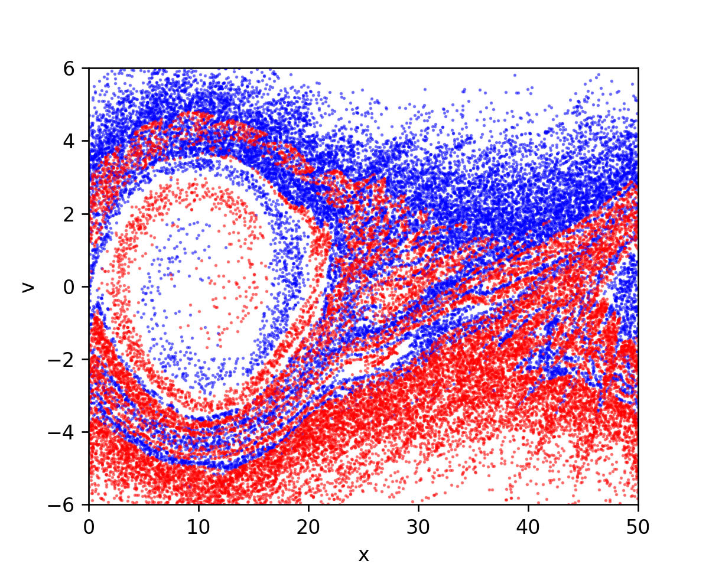

# CUDA-Implementation-of-PIC-Algorithm

This is a learning exercise to use GPU for scientific computing. The code is written in CUDA and C++ to simulate two electron beams passing through each other in opposite directions. This interesting phenomenon is called the two-stream instability.

Significant speed up is obtained with GPUs as compared to CPUs 

# Details
The code is direct implemntation of [blog](https://medium.com/swlh/create-your-own-plasma-pic-simulation-with-python-39145c66578b) which is written in python.

Extensive discription of the files and the results are given in the documentation.pdf attached with this repository. 

The code gives out the last time step plot as output with y axis as velocity and x axis as position:



# Building

The dependencies are- CUDA , GCC and Python 3.0

Go to the directory and run the shell script 

```
./run.sh
```

The shell script executes following commands:

a) Compiles all the files 
```
nvcc *.cu main.cpp -std=c++11
```

b) Runs the output file

```
./a.out
```

c) Plots the data from the text file of outputs (PICresult.txt) using a python code in (plot.py) 

```
python plot.py
```

To run the simulation on CPU:

Just change the input.h to define (device_CPU) and run the shell script run.sh (./run.sh)
